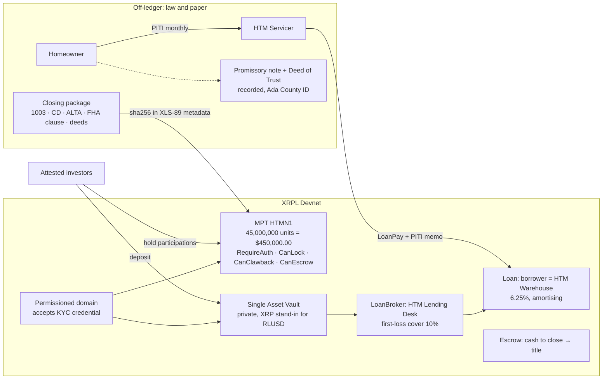

# xrpl-mortgage-tokenizing-htm

**A residential mortgage note on the XRP Ledger, end to end, on Devnet.**
High Tech Mortgage, Inc. · reference implementation submitted with our application to the
Brinc × XRPL **Hong Kong Financial Innovation Program** (tracks: Tokenization & Capital Markets, Credit & Lending).

[](https://github.com/vanfwilson/xrpl-mortgage-tokenizing-htm/actions)

> **Status: Devnet reference implementation.** Nothing here is a live financial product. HTM is not
> issuing tokens, taking deposits, or servicing loans on-chain in production. Every document is
> synthetic; every wallet is a faucet wallet. See [Compliance posture](#compliance-posture).

## What it does

One command takes a scanned closing package for a $450,000 FHA 30-year fixed loan and walks it
through the whole XRPL RWA stack that is live on Devnet today:

| # | Step | XRPL primitive | Standard |
|---|------|----------------|----------|
| 0 | OCR-normalise the 1003, Closing Disclosure, settlement statement, FHA clause, Deed of Trust and recorded Warranty Deed into one **canonical loan JSON**; hash the bundle | off-ledger | [canonical schema](src/ingest/canonical.ts) |
| 1 | Attest investors (KYC / accredited) and gather the attestations into a **permissioned domain** | `CredentialCreate/Accept`, `PermissionedDomainSet` | XLS-70, XLS-80 |
| 2 | Issue the note as **one permissioned Multi-Purpose Token**: units are USD cents of unpaid principal, metadata binds it to the document hash | `MPTokenIssuanceCreate`, `MPTokenAuthorize`, `Payment` | XLS-33, XLS-89 |
| 3 | Pool depositor capital in a **private Single Asset Vault** gated by the domain | `VaultCreate`, `VaultDeposit` | XLS-65 |
| 4 | Register a **LoanBroker**, post first-loss cover, and originate a fixed-term amortising loan with **two-party signing** | `LoanBrokerSet`, `LoanBrokerCoverDeposit`, `LoanSet` | XLS-66 |
| 5 | Lock the buyer's **cash to close** in a time-locked escrow to the title company and release it | `EscrowCreate/Finish` | native |
| 6 | **Service** the loan: `LoanPay` carrying the PITI breakdown as a memo, impair / un-impair, and with `--full-lifecycle` default and delete | `LoanPay`, `LoanManage`, `LoanDelete` | XLS-66 |

Every transaction hash and ledger-object ID lands in `out/latest.md` with Devnet explorer links.
The most recent run we did is in [docs/devnet-run.md](docs/devnet-run.md).

## The model (what each on-ledger object *is*)

Getting this mapping right was the main design work. A mortgage is not a DeFi loan, and pretending
otherwise is how tokenization projects lose credibility with reviewers.



| On-ledger object | Represents | Does **not** represent |
|---|---|---|
| **MPT `HTMN1`** | A permissioned *participation certificate* in the cash flows of one note. 1 unit = $0.01 of original principal. Issuer can lock, claw back (court order / error), and gate holders. | The promissory note, the lien, or title. Those stay in the recorded Deed of Trust and the servicing file. |
| **Single Asset Vault** | The *funding pool* (warehouse capital) supplied by attested depositors. | A deposit account for the homeowner. |
| **LoanBroker** | HTM's lending desk: underwriting off-chain, first-loss capital on-chain. | A bank or an exchange. |
| **Loan** | HTM Warehouse borrowing against the vault at the note rate. HTM, not the homeowner, is the on-chain borrower. The homeowner's PITI is what HTM remits. | The consumer mortgage. XLS-66 loans are uncollateralised on-ledger; the real collateral is the recorded lien. |
| **Escrow** | Closing funds "good at recording". | Impound / reserve escrow (taxes, insurance), which stays in servicing. |

## Quick start

```bash
git clone https://github.com/vanfwilson/xrpl-mortgage-tokenizing-htm && cd xrpl-mortgage-tokenizing-htm
npm ci
npm run ingest      # documents -> out/canonical-loan.json, validates tie-outs, OCR sample
npm test            # offline unit tests
npm run demo        # ~3 minutes on Devnet; faucet-funds 8 role wallets on first run
npm run demo:full   # also waits out the grace period and exercises default + delete
```

Requires Node 20+. No API keys. Devnet endpoint and explorer are in `.env.example`.
`out/wallets.json` keeps the Devnet seeds so re-runs reuse the same accounts (gitignored; Devnet XRP is worthless).

## Repository map

```
data/documents/        six synthetic closing documents as structured JSON (see docs/source for the PDF brief)
data/ocr-samples/      a deliberately degraded scan for the normaliser
src/ingest/            OCR repair + field extraction; canonical loan schema with cross-document tie-outs
src/domain/            amortisation math, XLS-66 rate units, XLS-89 metadata encoder, bundle hashing
src/xrpl/              client, faucet, submit-and-verify, CreatedNode lookup, Ripple-epoch helpers
src/steps/             one file per ledger phase (credentials, MPT, vault, lending, servicing, escrow, report)
src/demo.ts            orchestrator
tests/                 vitest; tests/devnet/ is live and opt-in (DEVNET=1)
docs/                  grant narrative, standards mapping, threat model, devnet run log, source brief
```

## Why the ledger side is honest about numbers

- **Units.** MPT `AssetScale: 2`, so `MaximumAmount` is exactly `45000000` cents. XLS-66 rates are in
  1/10 basis points, so 6.25 % is `6250`. Tested in `tests/loan-math.test.ts`.
- **Tie-outs.** The canonical record refuses to build if P&I, financed UFMIP, the ALTA debit/credit
  ledger, cash to close, PITI or LTV disagree across documents. The synthetic package ties to the
  cent: $2,770.73 P&I, $187.50 FHA MIP (0.50 % annual at 80 % LTV), $3,368.23 PITI, $91,400.00 cash to close.
- **Demo scale.** On Devnet, 1 XRP stands in for US$10,000. The loan schedule is compressed to
  12 payments at 60-second intervals so a full payment cycle happens inside one run.

## Compliance posture

This repository demonstrates *technical* feasibility. It makes no legal claims.

- The MPT is a participation certificate whose rights would be defined by a participation agreement.
  Offering such interests to investors is a securities activity; production would require the
  applicable exemption or registration (US: Reg D / Reg S; HK: SFC licensing or professional-investor
  exemption) and transfer restrictions, which is why `RequireAuth` and the permissioned domain exist.
- The **authoritative copy** of an eNote under UETA / E-SIGN lives in an eVault registered with MERS.
  We do not replicate MERS. The token metadata carries the document-bundle hash so a MERS eNote or
  paper note can be *bound* to the token, not replaced by it.
- Real borrower data never goes on-chain. Memos carry aggregate PITI figures only; the fixtures are fictitious.
- Idaho is a deed-of-trust state; the fixtures use a Deed of Trust with a title-company trustee.

Longer form: [docs/grant-narrative.md](docs/grant-narrative.md) · [docs/standards-mapping.md](docs/standards-mapping.md) · [docs/threat-model.md](docs/threat-model.md).

## About HTM

High Tech Mortgage, Inc. is a licensed US mortgage lender (Sacramento, CA) with an operations office
in Manila. MortgageOS™ is our digital-twin platform for the mortgage lifecycle; this repository is its
XRPL settlement layer prototype. Web: <https://hightechmortgage.com/tokenized-mortgages/>.

## License

MIT. Amendment availability checked against Devnet on 2026-09-04: MPTokensV1, DynamicMPT,
SingleAssetVault, LendingProtocol, PermissionedDomains, Credentials, TokenEscrow all enabled.
