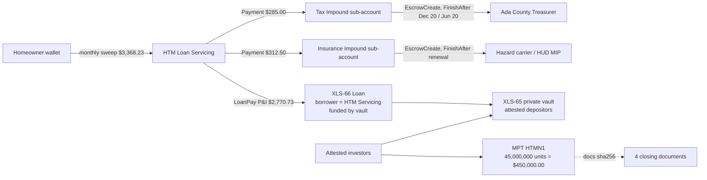

# xrpl-mortgage-tokenizing-htm

**A residential mortgage note on the XRP Ledger: paper in, servicing out. Devnet, end to end.**
High Tech Mortgage, Inc. · reference implementation for our application to the Brinc × XRPL
**Hong Kong Financial Innovation Program** (Tokenization & Capital Markets · Credit & Lending).

[](https://github.com/vanfwilson/xrpl-mortgage-tokenizing-htm/actions) [](https://github.com/vanfwilson/xrpl-mortgage-tokenizing-htm/actions/workflows/demo.yml)

**▶ Live demo (no install):** <https://vanfwilson.github.io/xrpl-mortgage-tokenizing-htm/demo/> — the printed package, the OCR scan-back, and the token, vault, loan and impound accounts read live from Devnet. Reviewers can rerun the whole thing on fresh wallets with one click on the [devnet-demo Action](https://github.com/vanfwilson/xrpl-mortgage-tokenizing-htm/actions/workflows/demo.yml).

> **Status: Devnet reference implementation.** Not a live financial product. HTM is not issuing
> tokens, taking deposits, or servicing loans on-chain in production. Every document is synthetic;
> every wallet is a faucet wallet. See [Compliance posture](#compliance-posture).

## The whole loop

```
 paper closing package ──scan──▶ OCR ──▶ canonical loan JSON ──▶ Postgres (system of record)
        ▲                                        │
        │ print                                  ▼
 filled official forms ◀── DB ◀── XRPL Devnet: MPT note · vault · loan · monthly 3-way sweep
```

1. **Four documents, nothing else.** Closing Disclosure (financial truth), Form 3200 Note (payment
   rules), Form 3013 Deed of Trust (lien, APN, legal), recorded Warranty Deed (registry). The URLA,
   ALTA statement and FHA clause are deliberately out: nothing recurring lives on them.
   See [docs/forms-and-sources.md](docs/forms-and-sources.md) for the official form URLs.
2. **Three servicing buckets, nothing else.** Every monthly sweep from the homeowner splits into
   P&I → lender vault, property tax → Tax Impound, hazard + FHA insurance → Insurance Impound,
   audited to the cent before a single transaction is built. HOA, home warranty and credit life are
   never impounded by a standard servicer, so the code never sees them.
3. **Native primitives only.** MPT (XLS-33/89) for the note, credentials + permissioned domain
   (XLS-70/80) for eligibility, Single Asset Vault (XLS-65) for funding, Lending Protocol (XLS-66)
   for the amortising facility, time-locked escrows for impound disbursement. No Hooks, no custom contract.

## Commands

```bash
npm ci
npm run ingest   # 4 documents -> canonical loan JSON; refuses to build if the figures do not tie out
npm test         # 29 offline tests
npm run print    # fill/typeset the official forms -> out/print/closing-package-stack.pdf (6 pages)
npm run scan -- out/print/closing-package-stack.pdf   # OCR the stack back, compare to the loan of record, emit LoanPay inputs
npm run demo     # ~5 min on Devnet: credentials, MPT, vault, loan, 2 monthly sweeps split 3 ways, impound escrows
npm run export   # canonical JSON, MISMO 3.4-aligned XML subset, XRPL payload templates
npm run db:seed | scripts/db-apply.sh -     # seed CouncilForge Postgres (htm_mortgages) from the fixtures
npm run db:record | scripts/db-apply.sh -   # mirror the latest Devnet run's objects + tx hashes into Postgres
npm run demo:publish                        # copy run report, stack PDF, scan report into docs/demo for the GitHub Pages demo
```

Requires Node 20+, `tesseract` and `pdftoppm` (poppler) for `scan`, SSH access to the database host for `db:*`.
Latest Devnet run with explorer links: [docs/devnet-run.md](docs/devnet-run.md).

## What each on-ledger object *is*



| Object | Represents | Does **not** represent |
|---|---|---|
| **MPT `HTMN1`** | Permissioned *participation certificate* in one note's cash flows; 1 unit = $0.01 of original principal; issuer can lock / claw back / gate holders; metadata carries the sha256 of the four documents | The promissory note or the lien. Those are the Form 3200 and the recorded Form 3013. |
| **Vault** | The funding pool supplied by KYC-attested depositors (XRP stands in for RLUSD on Devnet) | A consumer deposit account |
| **LoanBroker** | HTM Lending Desk: underwriting off-chain, first-loss cover on-chain | A bank |
| **Loan** | HTM Loan Servicing borrowing against the vault at the note rate; P&I sweeps repay it | The consumer mortgage; XLS-66 loans are uncollateralised on-ledger, the collateral is the recorded lien |
| **Impound sub-accounts + escrows** | Tax and insurance reserves, time-locked to the payee's statutory date | An "escrow account" in the closing sense |

## Repository map

```
data/documents/          the 4 synthetic closing documents as structured JSON (single source for DB, PDFs, ledger)
data/servicing-parties.json  county treasurer / carrier payees and their disbursement calendar
forms/blank/             official blank forms fetched from CFPB / Fannie Mae / Freddie Mac
src/ingest/              OCR repair + field extraction; canonical loan schema with tie-outs
src/servicing/           three-way split with checksum audit; impound disbursement scheduler
src/pdf/                 CD overlay on the CFPB blank; Form 3200 / 3013 / deed / statement typesetting
src/scan/                tesseract pipeline, compare-to-record, servicing-statement -> LoanPay gates
src/steps/               ledger phases: credentials, MPT, vault, lending, servicing sweep
src/db/                  seed + run recorder for the htm_mortgages Postgres schema (db/*.sql)
src/export/              MISMO 3.4-aligned XML subset, XRPL payload templates
scripts/                 db-apply / db-query over SSH, Python twin of the tax-vault scheduler
docs/                    forms & sources, grant narrative, standards mapping, threat model, run log
```

## Numbers that must tie

| Figure | Value | Source |
|---|---|---|
| Note amount | $450,000.00 = $442,125.00 base + $7,875.00 financed UFMIP | CD Loan Terms |
| Rate / term | 6.250 % / 360 months | Form 3200 s.2, s.3 |
| P&I | $2,770.73 | computed; must equal CD and Note |
| Tax impound | $285.00 / month ($3,420 / yr, two Ada County installments of $1,710) | CD Estimated Taxes |
| Insurance impound | $125.00 hazard + $187.50 FHA MIP (0.50 % at 80 % LTV) = $312.50 | CD Estimated Taxes + Mortgage Insurance |
| Monthly sweep | $3,368.23 | CD Estimated Total Monthly Payment |
| Late charge | 5 % of P&I = $138.54 after 15 days | Form 3200 s.6 |
| Cash to close | $91,400.00 | CD Calculating Cash to Close |

`npm run ingest` fails if any of these disagree across documents. On Devnet, 1 XRP stands in for
US$10,000 and one "month" is 60 seconds, so a full sweep cycle fits in a demo run.

## Database

Schema `htm_mortgages` in CouncilForge Postgres (`db/001_closing_package.sql`, `db/002_servicing_three_buckets.sql`):
`loans`, `parties`, `properties`, `loan_documents` (JSONB sections + sha256 + scan/OCR columns),
`settlement_lines`, `recurring_obligations`, `servicing_payments` (360 rows with `pi_part`/`tax_part`/`insurance_part`
and the four leg tx hashes), `impound_accounts`, `impound_disbursements`, `xrpl_objects`, `xrpl_transactions`.
The database is the system of record for documents and the servicing ledger; the XRPL ledger is authoritative
for token, vault and loan state; `db:record` reconciles the two.

## Compliance posture

Technical feasibility only; no legal claims. Participation interests are securities activity and would need
the applicable exemption (US Reg D / Reg S; HK professional-investor regime) and transfer restrictions, which is
why `RequireAuth` and the permissioned domain exist. The authoritative eNote lives in a MERS-registered eVault;
the token binds to its hash, it does not replace it. No borrower PII goes on-chain: memos carry loan id, period
and amounts only. Idaho is a deed-of-trust state (Form 3013). Longer form: [docs/grant-narrative.md](docs/grant-narrative.md)
· [docs/standards-mapping.md](docs/standards-mapping.md) · [docs/threat-model.md](docs/threat-model.md).

## About HTM

High Tech Mortgage, Inc. is a licensed US mortgage lender (Sacramento, CA) with an operations office in Manila.
MortgageOS™ is our digital-twin platform for the mortgage lifecycle; this repository is its XRPL settlement-layer
prototype. <https://hightechmortgage.com/tokenized-mortgages/>

MIT. Devnet amendments verified 2026-09-04: MPTokensV1, DynamicMPT, SingleAssetVault, LendingProtocol, PermissionedDomains, Credentials, TokenEscrow.
