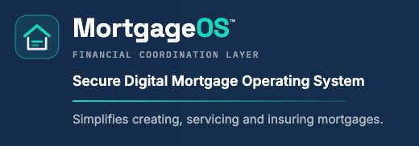
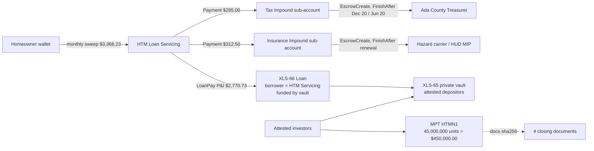

<p align="center">
  <a href="https://hightechmortgage.com"></a>
</p>
<p align="center">
  <a href="https://hightechmortgage.com/mortgageos.html"></a>
</p>

# Scan a closed home loan. Record it on the XRP Ledger.

## What this software does

This is the working software behind **MortgageOS™**, HighTechMortgage's digital mortgage operating system. It takes
the paper a title company produces when a home purchase closes, reads it, checks it, and records the loan on the
**XRP Ledger**, a public financial ledger that has run continuously since 2012.

In one sentence: **paper in, verified digital mortgage record out, funded and serviced on a public ledger, with no
personal data leaving the servicer's files.**

**Why a ledger instead of a paper file.** Today the original note sits in one escrow office's vault or one
servicer's filing cabinet. Loans are sold and re-sold, and after a few transfers nobody can say with certainty who
holds the original or whether a copy is genuine. Anyone with a printer can produce a convincing fake. A public ledger
record fixes that: one record, created once, visible to every party, impossible to alter or backdate, bound to the
exact paper by its fingerprint, and carrying the payment history for the life of the loan.

**Verifiable. Immutable. Traceable. Transferable. Auditable. Private. Fast. Open.**

What a lender, a title officer, or an investor gets from it:

- **A single, checked record of the loan.** The software reads every page, pulls out the loan number, amounts, rate,
  dates, parcel number and recording numbers, and refuses to continue unless every figure agrees across documents to
  the cent. Errors that would surface months later in servicing are caught the day the package is scanned.
- **A tamper-proof certificate of the note.** The loan becomes one token on the ledger whose description carries the
  fingerprint of the exact scanned paper. Anyone can verify that token exists and what it represents; nobody can alter it.
- **Funding and repayment on the same ledger.** Approved investors pool money in a vault; the servicer draws a
  fixed-term facility against it; each monthly payment is split into the three things a servicer actually collects
  (principal & interest, property tax, hazard insurance) and the tax and insurance reserves are locked to the county
  treasurer and the insurance carrier until their due dates.
- **A complete audit trail.** Every step is a signed transaction with a public ID. Reviewers can click each one.

What it does **not** do: it does not replace the Note, the Deed of Trust, the lien or the county record, and it never
puts a borrower's personal data on the ledger. Everything shown here runs on the ledger's public **test network** with
play money and a fictitious homeowner.

**See it:** [live demo page](https://vanfwilson.github.io/xrpl-mortgage-tokenizing-htm/demo/) · [the filled, signed closing package we scan (PDF)](package/closing-package-stack.pdf) · [step-by-step walkthrough](WALKTHROUGH.md) · [glossary for finance people](GLOSSARY.md) · [team and credentials](TEAM.md) · [our grant proposal](docs/grant-proposal-2026-08-24.pdf)

[](https://github.com/vanfwilson/xrpl-mortgage-tokenizing-htm/actions) [](https://github.com/vanfwilson/xrpl-mortgage-tokenizing-htm/actions/workflows/demo.yml)

---

## How it works, in plain words

When a home purchase closes, the title company produces a stack of paper: the Closing Disclosure, the promissory
Note, the Deed of Trust, the recorded deed, and supporting forms. Today that paper is scanned into a servicer's
filing system and the loan lives on as rows in a database that only the servicer can see.

This project does one extra thing with that same stack. After scanning, software reads the pages, checks that every
figure agrees across documents to the cent, and then records the loan on the **XRP Ledger**, a public, tamper-proof
ledger that has run since 2012. The record is a **token**: a digital certificate that says "this is the note whose
paper has this exact fingerprint, for this much principal, with these controls on who may hold it." The same ledger
then funds the loan from approved investors and tracks the monthly payment split into the three things a servicer
actually collects: principal & interest, property tax, and hazard insurance.

**What it is not.** The token does not replace the Note, the Deed of Trust, the lien or the county record. Those stay
exactly where the law puts them. No borrower personal data goes on the ledger, only amounts, dates and a fingerprint.
Everything here runs on the ledger's **test network** with play money and made-up documents for a fictitious homeowner.

## The five steps

| # | Step | What you see |
|---|---|---|
| 1 | **Print** the synthetic closing package: 12 documents, 23 pages, one homeowner, every signature line signed in blue ink. Official CFPB and Fannie Mae forms where they exist. | [package/](package/) |
| 2 | **Scan** it on any office scanner. | your PDF |
| 3 | **Read** it: OCR, page recognition, and a rebuilt loan record where every field says which document it came from. The run **stops** if a required field is missing or the numbers don't tie out. | `out/tokenize/<scan>.canonical.json` |
| 4 | **Tokenize** it: the note becomes one token on the ledger, bound to the scan's fingerprint; approved investors fund it through a vault; a 360-payment loan facility is originated to the servicer. | explorer links in `out/latest.md` |
| 5 | **Service** it (optional): monthly payment in, three buckets out, impounds time-locked to the county treasurer and the insurance carrier. | explorer links |

```bash
npm ci
npm run print                                            # step 1
npm run tokenize -- ~/scans/my-scan.pdf                  # steps 3–4 from your scan
npm run tokenize -- ~/scans/my-scan.pdf --service        # … plus step 5
```

Requires Node 20+, plus `tesseract` and `poppler` for OCR. No accounts or API keys: the test network hands out play money automatically.

## Which ledger standard does what

The XRP Ledger publishes numbered standards ("XLS-nn"). We **use** four of them; we do not write or change them.

| Standard | Plain meaning | What we create with it |
|---|---|---|
| **XLS-33 Multi-Purpose Token (MPT)** | the ledger's template for issuing a token with a fixed supply and holder controls | **the mortgage note token, `HTMN1`** (45,000,000 units = $450,000.00 principal) |
| **XLS-89 token metadata** | the agreed 1 KB description attached to a token | the note token's description, including the scan's fingerprint |
| **XLS-65 Single Asset Vault** | a pooled funding account with shares, optionally members-only | **one private vault** funded by two KYC-attested investors |
| **XLS-66 Lending Protocol** | a lending desk with first-loss capital and fixed-term amortising loans | **one LoanBroker and one 360-payment loan** to HTM Loan Servicing |

So: the OCR output becomes the **token** (XLS-33). The token's loan is then **funded** (XLS-65) and **originated** (XLS-66). Full definitions in [GLOSSARY.md](GLOSSARY.md).

---

## For engineers

### Paper in, token out

```bash
npm ci
npm run print                                   # produce the 23-page synthetic closing package to print
# print it, scan it back to a PDF (300 dpi is plenty), then:
npm run tokenize -- ~/scans/my-scan.pdf         # OCR -> rebuild the loan from the paper -> MPT + XLS-65 vault + XLS-66 loan on Devnet
npm run tokenize -- ~/scans/my-scan.pdf --service   # ...and run the monthly 3-way sweeps too
```

`tokenize` reads nothing from the database or the fixtures. It classifies each page (Closing Disclosure,
Note, Deed of Trust, Warranty Deed, statement), extracts every field with per-field provenance, refuses to
continue if a required field is missing or the figures do not tie out, hashes the scan file itself into the
token's XLS-89 metadata, and then issues the note token and funds it. Output: `out/tokenize/<scan>.canonical.json`
(with `_provenance`), `out/latest.md` with explorer links.

### Other commands

```bash
npm run ingest   # fixtures -> canonical loan JSON; refuses to build if the figures do not tie out
npm test         # 32 offline tests, including rebuilding the loan from saved OCR text
npm run scan -- out/print/closing-package-stack.pdf   # OCR only: scanned-loan.json + compare-to-record report + LoanPay gates
npm run demo     # ~5 min on Devnet from the fixtures: credentials, MPT, vault, loan, 2 monthly sweeps split 3 ways, impound escrows
npm run export   # canonical JSON, MISMO 3.4-aligned XML subset, XRPL payload templates
npm run db:seed | scripts/db-apply.sh -     # seed CouncilForge Postgres (htm_mortgages) from the fixtures
npm run db:record | scripts/db-apply.sh -   # mirror the latest Devnet run's objects + tx hashes into Postgres
npm run demo:publish                        # copy run report, stack PDF, scan report into docs/demo for the GitHub Pages demo
```

Requires Node 20+, `tesseract` and `pdftoppm` (poppler) for `scan`, SSH access to the database host for `db:*`.
Latest Devnet run with explorer links: [docs/devnet-run.md](docs/devnet-run.md).

### What each on-ledger object *is*



| Object | Represents | Does **not** represent |
|---|---|---|
| **MPT `HTMN1`** | Permissioned *participation certificate* in one note's cash flows; 1 unit = $0.01 of original principal; issuer can lock / claw back / gate holders; metadata carries the sha256 of the four documents | The promissory note or the lien. Those are the Form 3200 and the recorded Form 3013. |
| **Vault** | The funding pool supplied by KYC-attested depositors (XRP stands in for RLUSD on Devnet) | A consumer deposit account |
| **LoanBroker** | HTM Lending Desk: underwriting off-chain, first-loss cover on-chain | A bank |
| **Loan** | HTM Loan Servicing borrowing against the vault at the note rate; P&I sweeps repay it | The consumer mortgage; XLS-66 loans are uncollateralised on-ledger, the collateral is the recorded lien |
| **Impound sub-accounts + escrows** | Tax and insurance reserves, time-locked to the payee's statutory date | An "escrow account" in the closing sense |

### Repository map

```
data/documents/          the 4 tokenization documents as structured JSON (single source for DB, PDFs, ledger)
data/supporting/         URLA 1003, settlement statement, FHA clause fixtures (printed, scanned, not needed to tokenize)
package/                 the printed, filled, signed 23-page closing package and its 12 component PDFs
data/servicing-parties.json  county treasurer / carrier payees and their disbursement calendar
forms/blank/             official blank forms fetched from CFPB / Fannie Mae / Freddie Mac
src/ingest/              OCR repair + field extraction; canonical loan schema with tie-outs
src/servicing/           three-way split with checksum audit; impound disbursement scheduler
src/pdf/                 CD overlay on the CFPB blank; Form 3200 / 3013 / deed / statement typesetting
src/scan/                tesseract pipeline, compare-to-record, servicing-statement -> LoanPay gates
src/steps/               ledger phases: credentials, MPT, vault, lending, servicing sweep
src/db/                  seed + run recorder for the htm_mortgages Postgres schema (db/*.sql)
src/export/              MISMO 3.4-aligned XML subset, XRPL payload templates
scripts/                 db-apply / db-query over SSH
extras/servicing-automation/  Python scheduler, xrpl-py disbursement builder, FastAPI dashboard (beyond grant scope)
docs/                    forms & sources, grant narrative, standards mapping, threat model, run log
```

### Numbers that must tie

| Figure | Value | Source |
|---|---|---|
| Note amount | $450,000.00 = $442,125.00 base + $7,875.00 financed UFMIP | CD Loan Terms |
| Rate / term | 6.250 % / 360 months | Form 3200 s.2, s.3 |
| P&I | $2,770.73 | computed; must equal CD and Note |
| Tax impound | $285.00 / month ($3,420 / yr, two Ada County installments of $1,710) | CD Estimated Taxes |
| Insurance impound | $125.00 hazard + $187.50 FHA MIP (0.50 % at 80 % LTV) = $312.50 | CD Estimated Taxes + Mortgage Insurance |
| Monthly sweep | $3,368.23 | CD Estimated Total Monthly Payment |
| Late charge | 5 % of P&I = $138.54 after 15 days | Form 3200 s.6 |
| Cash to close | $91,400.00 | CD Calculating Cash to Close |

`npm run ingest` fails if any of these disagree across documents. On Devnet, 1 XRP stands in for
US$10,000 and one "month" is 60 seconds, so a full sweep cycle fits in a demo run.

### Database

Schema `htm_mortgages` in CouncilForge Postgres (`db/001_closing_package.sql`, `db/002_servicing_three_buckets.sql`):
`loans`, `parties`, `properties`, `loan_documents` (JSONB sections + sha256 + scan/OCR columns),
`settlement_lines`, `recurring_obligations`, `servicing_payments` (360 rows with `pi_part`/`tax_part`/`insurance_part`
and the four leg tx hashes), `impound_accounts`, `impound_disbursements`, `xrpl_objects`, `xrpl_transactions`.
The database is the system of record for documents and the servicing ledger; the XRPL ledger is authoritative
for token, vault and loan state; `db:record` reconciles the two.

### Compliance posture

Technical feasibility only; no legal claims. Participation interests are securities activity and would need
the applicable exemption (US Reg D / Reg S; HK professional-investor regime) and transfer restrictions, which is
why `RequireAuth` and the permissioned domain exist. The authoritative eNote lives in a MERS-registered eVault;
the token binds to its hash, it does not replace it. No borrower PII goes on-chain: memos carry loan id, period
and amounts only. Idaho is a deed-of-trust state (Form 3013). Longer form: [docs/grant-narrative.md](docs/grant-narrative.md)
· [docs/standards-mapping.md](docs/standards-mapping.md) · [docs/threat-model.md](docs/threat-model.md).

### About HTM

High Tech Mortgage, Inc. is a licensed US mortgage lender (Sacramento, CA) with an operations office in Manila.
MortgageOS™ is our digital-twin platform for the mortgage lifecycle; this repository is its XRPL settlement-layer
prototype. <https://hightechmortgage.com/tokenized-mortgages/>

Licence: MIT License (the software licence, unrelated to the MIT university credential on the team page). Devnet amendments verified 2026-09-04: MPTokensV1, DynamicMPT, SingleAssetVault, LendingProtocol, PermissionedDomains, Credentials, TokenEscrow.
