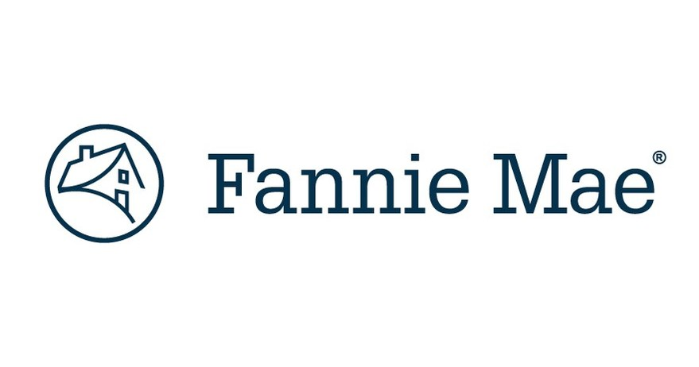
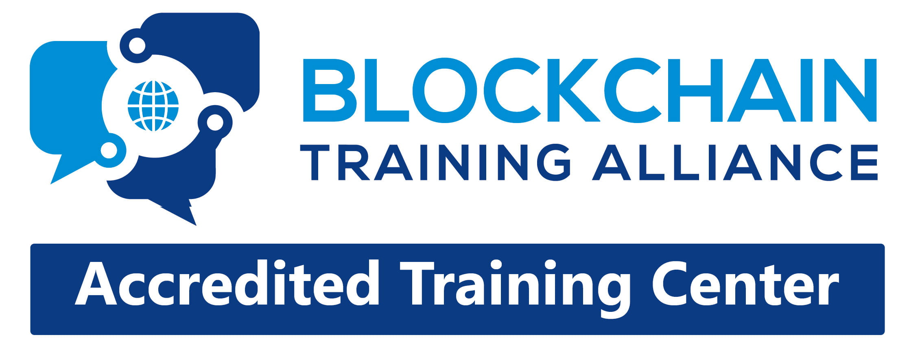
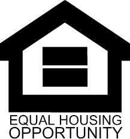

# Team and credentials

**HighTechMortgage, Inc.** is a licensed US mortgage lender and real-estate brokerage in Sacramento, California, with an
operations centre in Metro Manila, Philippines. Founded by Bay Area mortgage and real estate veteran Rich Young, it
combines more than three decades of lending experience with a data-science and technology team. **MortgageOS™** is its
digital mortgage operating system; this repository is MortgageOS's XRP Ledger settlement-layer prototype and the working
proof of concept behind our [August 2026 grant proposal](docs/grant-proposal-2026-08-24.pdf).

Credentials below are as published on <https://hightechmortgage.com/about/>.

<table>
<tr>
<td width="140"></td>
<td><b>Rich Young</b> — Founder, President &amp; Lead Broker 
32+ years in real estate and mortgage lending. California DRE Broker's License #01106294 · California Mortgage Broker NMLS #291547. 
<i>On this project:</i> owns the origination, servicing and compliance obligations the pipeline models; the lender of record for the pilot.</td>
</tr>
<tr>
<td></td>
<td><b>Dr. Van Wilson</b> — Data Science, AI &amp; Blockchain Technology 
Massachusetts Institute of Technology, post-graduate programme in AI / data science · California State University, Fullerton, bachelor's degree · AWS Certified Developer · Databricks certified · Blockchain Training Alliance certified · Microsoft Certified Trainer · Tableau Server Admin · PostgreSQL, SQL Server, MySQL DBA · ERP certified (Sage, QuickBooks, MS Nav developer/trainer) · real-estate investor and manager · 35+ years in financial data. 
<i>On this project:</i> designed the paper-to-ledger pipeline, the three-bucket servicing model and the MortgageOS digital twin; wrote and reviews the code in this repository.</td>
</tr>
<tr>
<td></td>
<td><b>Trish Wilson</b> — Real Estate, Finance &amp; Philippine Operations 
Active licensed US Realtor · Philippine Real Estate Broker, PRC #0024025 · Certified Public Accountant · International Certified Financial Consultant · Life insurance agent · Blockchain-certified agent · Property and asset manager · former Internal Auditor, Philippine Airlines · St. Paul University, Philippines, BA Accounting. 
<i>On this project:</i> leads the Manila document-processing team that runs the scanning pilot; accounting review of the tie-outs.</td>
</tr>
<tr>
<td></td>
<td><b>Bill Thompson</b> — Operations, IT &amp; Business Management 
ITIL v4 · Six Sigma Quality · CompTIA A+ · TOPCIT · Practical Project Management · URAC · FranklinCovey Management · Ateneo Graduate School of Business · California State University, Dominguez Hills. 
<i>On this project:</i> operations, infrastructure and process discipline for the pilot.</td>
</tr>
</table>

 &nbsp;
 &nbsp;
 &nbsp;
 &nbsp;
 &nbsp;
 &nbsp;
 &nbsp;
 &nbsp;
 &nbsp;
 &nbsp;

## Why this team can deliver

- **We are the lender.** The closing packages, the servicing obligations and the regulatory exposure are ours, not a hypothetical partner's.
- **We already run the adjacent systems.** MortgageOS on Cloudflare Workers with a Postgres system of record, a KYC/credential model, and a trained document-processing workforce in Manila, in Hong Kong's time zone.
- **The design lead writes the code.** Every ledger transaction linked from this repository was produced by scripts in `src/` and can be re-run by any reviewer on the XRP Ledger's public test network.

## Two different "MIT"s

This code is released under the **MIT License**, a standard permissive open-source *software* licence (see `LICENSE`).
It is unrelated to the **Massachusetts Institute of Technology**, where Dr. Wilson completed a post-graduate programme.
