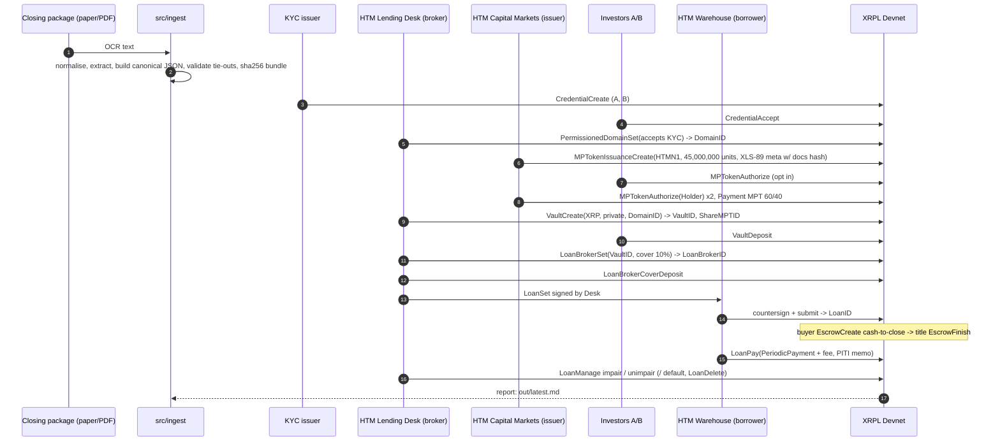

# Architecture

## Accounts and reserves

Eight Devnet accounts, one per role, funded from the faucet (100 XRP each). Objects and their owners:

| Object | Owner | Reserve |
|---|---|---|
| Credential ×2 | investors (subject) after accept | 1 each |
| PermissionedDomain | broker | 1 |
| MPTokenIssuance | issuer | 1 |
| MPToken ×2 | investors | 1 each |
| Vault (+ pseudo-account, share MPT issuance) | broker | 1 |
| LoanBroker (+ pseudo-account) | broker | 1 |
| Loan | borrower | 1 |
| Escrow | buyer (until finished) | 1 |

## Failure handling

Critical steps (credentials, MPT, vault, broker, LoanSet) fail the run. Servicing and escrow steps
are "soft": a failure is recorded in the report's Notes and the run continues, so a reviewer always
gets a complete report. Credentials are idempotent on reused wallets.

## Devnet vs production

| Concern | Devnet demo | Production |
|---|---|---|
| Vault asset | XRP, 1 XRP = $10,000 | RLUSD or bank stablecoin |
| Loan schedule | 12 × 60 s | 360 × 30 days |
| Keys | single faucet key per role | multisig + HSM, `lsfDisableMaster` |
| Holder gating | explicit `MPTokenAuthorize(Holder)` | `DomainID` on the issuance + credential expiry |
| Escrow release | timer | recording confirmation via authorised signer |
| Document source | JSON fixtures | eVault eNote hash + custodian credential |
